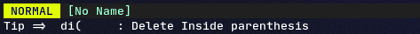

# Vim-Tips

A simple plugin that display a tip at startup, no configuration required



## Installation

Use your favorite plugin manager; ex `vim-plug`:

```vim
Plug 'michaelb/vim-tips'
```

You need a python(3+)-enabled vim/neovim

## Usage

vim-tips prints a message in the command area at startup.

However, you can request tips by calling the function `GetTip()` to get a string value usable in vimscript. Ex:

```
let tip = GetTip()
echo tip
```

## Add your own tips

If you want, you can add your own tips by modifying the files in the tips folder.
You may find them on your own system (probably in your plugin manager's files), but to simplify that I suggest forking my repo and adding your own changes in a version controlled repo.

Tips must escape single quotes. (Just avoid them in general)

## Important note

If you are using an autoload session restore (from mksession) it displays a message and therefore hide the vim-tips message.

## Your own mappings

vim-tips reads from your vim/neovim config file and displays the lines it recognizes.

For example;
`nnoremap gd :ALEGoToDefinition`
will display the tip "Config => gd :ALEGoToDefinition (normal mode)".

If you'd like to display tips (versus mappings from your own config file), you can adjust the frequency via
`let g:vim_tips_tips_frequency=0.5` (with a value between 0.0 and 1.0, higher value increase tips frequency)
